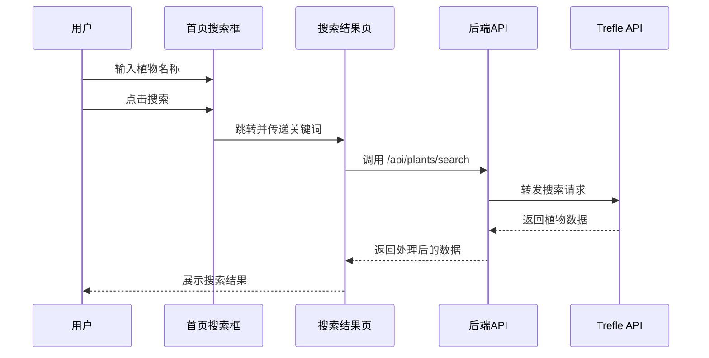

# 小程序首页搜索框调用 Trefle API 完成文档

## 1. 功能概述

本功能实现了小程序首页搜索框通过 Trefle API 进行植物搜索的完整流程，用户可以在首页输入植物名称，点击搜索后跳转到搜索结果页，展示从 Trefle API 获取的植物信息。

## 2. 技术架构

### 2.1 整体流程



### 2.2 代码结构

```
├── pages/
│   ├── index/
│   │   └── index.vue       # 首页搜索框实现
│   └── search/
│       └── search.vue      # 搜索结果页实现
├── server/
│   └── app.js              # 后端API实现（Trefle代理）
└── .env                    # 环境变量配置（Trefle API Token）
```

## 3. 前端实现

### 3.1 首页搜索框（pages/index/index.vue）

**核心代码：**

```vue
<view class="search-section">
    <view class="search-bar">
        <uni-icons type="search" size="20" color="#717182"></uni-icons>
        <input 
            type="text" 
            v-model="searchKeyword" 
            placeholder="搜索植物名称，例如：兰花" 
            class="search-input"
            confirm-type="search"
            @confirm="onSearch"
        />
        <view class="camera-btn" @tap.stop="handleCamera">
            <uni-icons type="camera-filled" size="20" color="030213"></uni-icons>
        </view>
    </view>
</view>
```

**搜索方法：**

```javascript
methods: {
    onSearch() {
        if (!this.searchKeyword.trim()) return;
        console.log('搜索中:', this.searchKeyword);
        uni.navigateTo({
            url: `/pages/search/search?keyword=${this.searchKeyword}`
        });
    }
}
```

### 3.2 搜索结果页（pages/search/search.vue）

**核心代码：**

```javascript
onLoad(options) {
    this.query = options.keyword || '';
    // 获取导航栏高度...

    if (this.query) {
        this.initSearch();
    }
},
methods: {
    initSearch() {
        this.isLoading = true;
        this.varieties = [];
        
        const url = `${this.baseUrl}/api/plants/search`;
        console.log('发起搜索请求 URL:', url);
        console.log('搜索关键词:', this.query);

        uni.showLoading({ title: '搜索中...', mask: true });

        uni.request({
            url: url,
            method: 'GET',
            data: {
                q: this.query
            },
            success: (res) => {
                uni.hideLoading();
                
                if (res.data.code === 200) {
                    // 映射 Trefle 数据格式
                    this.varieties = res.data.data.map(item => ({
                        name: item.common_name || item.scientific_name,
                        latinName: item.scientific_name,
                        image: item.image_url || '/static/plant-placeholder.png',
                        description: `Family: ${item.family || 'Unknown'}`
                    }));
                    
                    if (this.varieties.length === 0) {
                        uni.showToast({ title: '未找到相关植物', icon: 'none' });
                    }
                } else {
                    uni.showToast({ title: res.data.message || '搜索服务异常', icon: 'none' });
                }
            },
            fail: (err) => {
                uni.hideLoading();
                console.error('搜索请求失败详情:', err);
                uni.showToast({ title: '网络连接失败，请检查网络', icon: 'none' });
            },
            complete: () => {
                this.isLoading = false;
            }
        });
    }
}
```

## 4. 后端实现

### 4.1 Trefle API 代理接口（server/app.js）

**核心代码：**

```javascript
// Trefle 植物搜索接口 (代理转发)
app.get('/api/plants/search', async (req, res) => {
    const query = req.query.q;
    const token = process.env.TREFLE_API_TOKEN;

    if (!query) {
        return res.status(400).json({ code: 400, message: '缺少搜索关键词' });
    }

    if (!token || token === '你的TREFLE_TOKEN') {
        // 如果未配置 Token，返回演示数据
        console.log('未配置 Trefle Token，返回本地演示搜索结果');
        const mockResults = [
            {
                common_name: "Mock " + query + " (演示)",
                scientific_name: "Mock Scientific Name",
                image_url: "https://images.unsplash.com/photo-1463936575829-25148e1db1b8?w=800&q=80",
                family: "Mock Family"
            },
            {
                common_name: "Wild " + query,
                scientific_name: "Wildus Plantae",
                image_url: "https://images.unsplash.com/photo-1518531933037-91b2f5f229cc?w=800&q=80",
                family: "Wild Family"
            }
        ];
        return res.json({
            code: 200,
            message: '演示数据(主要Token未配置)',
            data: mockResults
        });
    }

    console.log(`正在搜索 Trefle: ${query}`);
    console.log(`Token Prefix: ${token ? token.substring(0, 4) + '****' : 'None'}`);

    const options = {
        hostname: 'trefle.io',
        path: `/api/v1/plants/search?token=${token}&q=${encodeURIComponent(query)}`,
        method: 'GET',
        family: 4
    };

    const externalReq = https.request(options, (externalRes) => {
        let data = '';
        externalRes.on('data', (chunk) => data += chunk);
        externalRes.on('end', () => {
            console.log(`Trefle Status: ${externalRes.statusCode}`);
            try {
                const json = JSON.parse(data);

                // [DEBUG] 如果状态码不对或有 error 字段，打印详细日志
                if (externalRes.statusCode !== 200 || json.error) {
                    console.error('Trefle API Error Response:', data);
                    return res.status(externalRes.statusCode).json({
                        code: externalRes.statusCode,
                        message: json.message || 'Trefle API Error',
                        error: json
                    });
                }

                console.log(`Trefle 搜索成功，找到 ${json.data ? json.data.length : 0} 条结果`);
                res.json({
                    code: 200,
                    data: json.data || []
                });
            } catch (e) {
                console.error('Trefle 响应解析失败:', e);
                console.error('原始响应数据:', data);
                res.status(500).json({ code: 500, message: '第三方数据异常' });
            }
        });
    });

    externalReq.on('error', (e) => {
        console.error('Trefle 请求失败:', e);
        res.status(500).json({ code: 500, message: '搜索服务暂时不可用' });
    });

    externalReq.end();
});
```

## 5. 环境配置

### 5.1 Trefle API Token 获取

1. 访问 [Trefle 官网](https://trefle.io/)
2. 注册并登录账号
3. 进入 API Keys 页面获取 API Token

### 5.2 环境变量配置

在 `server/.env` 文件中添加 Trefle API Token：

```env
# Trefle API 配置
TREFLE_API_TOKEN=your_trefle_api_token_here
```

**注意：** 替换 `your_trefle_api_token_here` 为实际的 API Token。

## 6. 测试与调试

### 6.1 前端测试

1. 在小程序首页搜索框输入植物名称，如 "兰花"
2. 点击搜索按钮或键盘上的搜索键
3. 观察是否跳转到搜索结果页并显示相关植物信息

### 6.2 后端测试

使用 Postman 或浏览器直接测试后端 API：

```
http://localhost:3000/api/plants/search?q=orchid
```

### 6.3 调试日志

后端会生成详细的调试日志：
- 搜索关键词和时间戳
- Trefle API 请求状态码
- 错误响应详情
- 搜索结果数量

日志会输出到控制台，并追加到 `server/debug.log` 文件。

## 7. 功能特性

### 7.1 核心功能

- **实时搜索**：输入关键词后实时发起搜索请求
- **结果展示**：展示植物的中文名称、拉丁学名、图片和科属信息
- **错误处理**：网络异常、API 错误等情况的友好提示
- **演示模式**：未配置 Trefle Token 时返回模拟数据

### 7.2 数据格式

前端接收的数据格式：

```javascript
{
    code: 200,
    data: [
        {
            name: "植物名称",
            latinName: "拉丁学名",
            image: "图片URL",
            description: "科属信息"
        }
        // 更多植物...
    ]
}
```

## 8. 优化建议

### 8.1 前端优化

1. **搜索历史**：添加搜索历史记录功能
2. **搜索联想**：实现输入时的搜索联想功能
3. **图片懒加载**：优化搜索结果页图片加载性能
4. **分页加载**：添加分页或滚动加载更多功能

### 8.2 后端优化

1. **缓存机制**：添加搜索结果缓存，减少重复请求
2. **请求限流**：添加 API 请求限流，防止滥用
3. **数据过滤**：对 Trefle API 返回的数据进行更精细的过滤和处理
4. **错误重试**：添加网络错误自动重试机制

### 8.3 用户体验

1. **加载动画**：优化搜索过程中的加载动画
2. **空结果处理**：未找到结果时的友好提示
3. **排序功能**：添加结果排序选项（如按相似度、按名称等）
4. **筛选功能**：添加按科属、生长环境等筛选功能

## 9. 常见问题与解决方案

### 9.1 问题：搜索无结果

**可能原因：**
- Trefle API Token 配置错误
- 网络连接问题
- 关键词拼写错误或过于模糊

**解决方案：**
- 检查 `.env` 文件中的 Trefle API Token
- 确认网络连接正常
- 尝试使用更常见的植物名称

### 9.2 问题：图片显示异常

**可能原因：**
- Trefle API 返回的图片 URL 无效
- 网络加载超时

**解决方案：**
- 检查 `search.vue` 中的图片占位符设置
- 优化图片加载逻辑，添加错误处理

### 9.3 问题：API 请求失败

**可能原因：**
- Trefle API 服务暂时不可用
- API Token 已过期
- 请求频率过高被限制

**解决方案：**
- 检查 Trefle API 服务状态
- 确认 API Token 是否有效
- 减少请求频率，添加延迟

## 10. 总结

本实现完成了小程序首页搜索框通过 Trefle API 进行植物搜索的完整功能，包括：

- 首页搜索框的交互实现
- 搜索结果页的数据展示
- 后端 API 的代理转发
- 环境变量的配置管理
- 错误处理和调试日志

该功能为用户提供了便捷的植物搜索能力，通过整合 Trefle API 的丰富植物数据，提升了小程序的实用性和专业性。

---

**文档版本：** v1.0
**创建日期：** 2026-02-05
**更新日期：** 2026-02-05