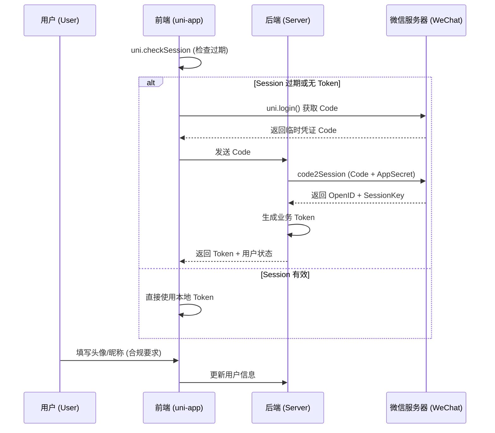

# 微信登录开发指南 (基于 uni-app 官方规范)

本指南参考 `uni-app` 官方文档及微信小程序最新安全规范编写，旨在实现一个安全、合规且流畅的登录流程。

---

## 一、 开发准备与配置

### 1. 微信公众平台配置
- **获取凭证**: 在小程序后台获取 `AppID` 和 `AppSecret`（注意：`AppSecret` **严禁**存放在前端代码中）。
- **配置服务器**: 在“开发设置”中配置“request 合法域名”，即您的后端接口地址。

### 2. 项目代码配置
- **manifest.json**: 在 `mp-weixin` 节点下正确填写 `appid`。

---

## 二、 标准登录流程 (Step-by-Step)

### 第一步：检查登录态 (uni.checkSession)
在应用启动 (`App.vue` 的 `onLaunch`) 或登录页加载时，先检查当前 session 是否过期。
- **目的**: 避免频繁调用 `uni.login`，提升响应速度。
- **逻辑**: 如果有效且本地有 Token，则无需重登；否则进入下一步。

### 第二步：获取临时凭证 (uni.login)
调用 `uni.login` 获取临时登录凭证 `code`。
```javascript
uni.login({
    provider: 'weixin',
    success: (res) => {
        if (res.code) {
            // 将 res.code 发送给后端换取 OpenID 和 Token
            this.loginToServer(res.code);
        }
    }
});
```

### 第三步：后端换取身份标识 (auth.code2Session)
- **后端操作**: 收到 `code` 后，由后端请求微信接口 `https://api.weixin.qq.com/sns/jscode2session`。
- **返回值**: 微信将返回 `openid` (用户标识) 和 `session_key`。
- **Token 生成**: 后端根据 `openid` 在数据库关联用户，并生成自定义的 `access_token` 返回给前端。

### 第四步：合规获取用户信息 (头像昵称填写)
根据微信最新合规要求，不再支持 `getUserProfile` 直接授权，需引导用户填写：
1. **头像选择**: 
   ```html
   <button class="avatar-wrapper" open-type="chooseAvatar" @chooseavatar="onChooseAvatar">
     <image class="avatar" :src="avatarUrl"></image>
   </button>
   ```
2. **昵称填写**:
   ```html
   <input type="nickname" class="weui-input" placeholder="请输入昵称"/>
   ```

### 第五步：Token 存储与请求拦截
- **本地存储**: 使用 `uni.setStorageSync('token', token)` 持久化。
- **请求携带**: 封装 `uni.request` 拦截器，在 Header 中自动注入 `Authorization: Bearer <Token>`。

---

## 三、 状态图 (Mermaid)



---

## 四、 开发计划建议

1. **新建页面**: `pages/login/login.vue` 处理 UI 展示。
2. **工具类封装**: 创建 `utils/auth.js` 统一管理 Token 和登录逻辑。
3. **拦截器**: 在 `main.js` 或专用网络请求类中处理 Token 注入。

**如果您确认此细化方案，我们将按照此步骤开始 `pages/login/login.vue` 的 UI 实现。**
